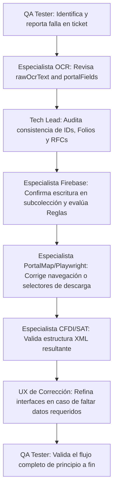

# ZenTicket ECC Specialized Skill

Este documento define la estructura, responsabilidades y guías de coordinación para los 8 especialistas encargados de auditar, diseñar, implementar y verificar el sistema de automatización de facturas en ZenTicket.

---

## 1. Roles y Responsabilidades de los Especialistas

### 1.1. Tech Lead de Flujo Fiscal
* **Objetivo principal**: Garantizar la integridad semántica de los datos fiscales a lo largo de todo el ciclo de vida del ticket.
* **Directrices de Auditoría**:
  * **No mezclar identificadores**: El ID interno de Firestore (ej. `ticket_1plmibkd`) nunca debe usarse como el folio de facturación (`folio` o `billingReference`), ni confundirse con el UUID fiscal (`folioFiscal`).
  * **Validación de RFCs**: Verificar constantemente la direccionalidad de los RFCs (el RFC emisor corresponde al comercio, el RFC receptor corresponde al cliente).
  * **Consistencia de Totales**: Asegurar que los importes totales no sufran pérdidas de precisión decimal ni redondeos incorrectos al convertirse entre strings y floats.

### 1.2. Especialista OCR
* **Objetivo principal**: Auditar y limpiar la entrada del motor de lectura de tickets (Gemini/OpenAI Vision).
* **Directrices**:
  * **Análisis de `rawOcrText`**: Verificar que el texto plano extraído del ticket sea la única fuente para buscar datos estructurados antes de recurrir a heurísticas.
  * **Prevención de Alucinaciones**: Detectar si el OCR inventó folios, fechas o importes inexistentes en el ticket físico.
  * **Mapeo a `portalFields`**: Asegurar la correcta extracción de campos específicos requeridos por el conector (referencias de facturación, número de ticket, sucursal, etc.).

### 1.3. Especialista UX de Corrección
* **Objetivo principal**: Optimizar las pantallas donde el usuario revisa y corrige los datos antes de lanzar la automatización.
* **Directrices**:
  * **Claridad en Campos Faltantes**: Si el OCR no detectó un campo requerido (ej. la referencia de facturación), la UI debe marcar de forma clara y destacada qué campo se necesita y dónde encontrarlo en el ticket.
  * **Flujo del Formulario**: Asegurar un diseño responsivo, limpio (utilizando `bg-slate-50` y tipografías uniformes como Inter) y con micro-animaciones en los estados de carga y error.

### 1.4. Especialista PortalMap
* **Objetivo principal**: Diseñar y auditar las reglas de navegación del portal del comercio (`portal_maps`).
* **Directrices**:
  * **Esquema de Campos**: Definir de forma precisa en el conector cuáles campos son obligatorios (`requiredFields`), mapear sus selectores CSS y definir el comportamiento del flujo (`stepsJson`).
  * **Control de Errores y Captcha**: Identificar selectores CSS de mensajes de error (`errorSelectors`) y elementos de bloqueo/captcha (`captchaSelectors`).

### 1.5. Especialista Playwright Runner
* **Objetivo principal**: Mantener el motor de ejecución automatizada (`runner`) robusto ante fallos del portal oficial.
* **Directrices**:
  * **Manejo de Tiempos**: Implementar esperas dinámicas (`waitForSelector` con timeouts controlados) en lugar de tiempos muertos estáticos (`sleep`).
  * **Captura de Evidencias**: Asegurar que en caso de fallo se capturen capturas de pantalla (`screenshots`) y se guarden en Cloud Storage de forma segura, asignando la ruta de la evidencia al error del ticket.
  * **Descargas Seguras**: Verificar la correcta obtención y guardado en Storage privado del XML y PDF oficial del CFDI.

### 1.6. Especialista Firebase
* **Objetivo principal**: Velar por el esquema de datos, rendimiento y seguridad de Firestore y Storage.
* **Directrices**:
  * **Ruta de Facturas**: Las facturas de los usuarios deben guardarse única y estrictamente en su subcolección dedicada `/users/{userId}/invoices/{invoiceId}` para cumplir con las reglas de privacidad y ser leídas correctamente por el frontend.
  * **Reglas de Seguridad**: Mantener actualizadas las reglas en `firestore.rules`, garantizando que tanto la base de datos `(default)` como las instancias con nombre (ej. `ai-studio-...`) hereden las mismas reglas de lectura/escritura seguras.
  * **Snapshots Inmutables**: Al crear un `invoice_job`, capturar snapshots inmutables del ticket y del perfil fiscal para evitar discrepancias si el usuario edita sus datos mientras el runner está procesando el ticket.

### 1.7. Especialista CFDI/SAT
* **Objetivo principal**: Garantizar que el CFDI XML descargado sea legalmente válido y corresponda al ticket original.
* **Directrices**:
  * **Estructura XML**: Validar la existencia del nodo `cfdi:Comprobante` y el complemento `tfd:TimbreFiscalDigital`.
  * **Validación SAT Real**: Ejecutar consultas HTTP seguras contra el WS de verificación del SAT usando los RFCs, UUID y total para confirmar el estado ("Vigente", "Cancelado").

### 1.8. QA Tester
* **Objetivo principal**: Coordinar las pruebas de integración con tickets físicos reales y documentar los flujos de estado.
* **Directrices**:
  * **Prueba de Transición de Estados**: Verificar que un ticket pase limpiamente por los estados: `ticket_uploaded` -> `connector_resolving` -> `queued_for_runner` -> `runner_processing` -> `completed` (o `requires_manual_review` en caso de un error legítimo del portal).
  * **Documentación de Fallas**: Reportar con detalle los estados finales de tickets fallidos para retroalimentar al especialista de Playwright o PortalMap.

---

## 2. Flujo de Comunicación y Protocolo de Trabajo

Cuando se desarrolle una funcionalidad o se depure un error en ZenTicket, los especialistas deben interactuar siguiendo este flujo secuencial:

1. **Investigación de Entrada**: El Especialista OCR y el Tech Lead de Flujo Fiscal analizan los datos iniciales y el ticket físico.
2. **Infraestructura**: El Especialista Firebase asegura que la persistencia en las colecciones y la evaluación de las reglas de seguridad no bloqueen el flujo de encolamiento.
3. **Automatización**: El Especialista PortalMap y de Playwright aseguran la comunicación limpia con el portal del comercio.
4. **Verificación**: El Especialista CFDI/SAT y el QA Tester confirman el timbrado oficial y la persistencia de la factura en el historial del usuario.
