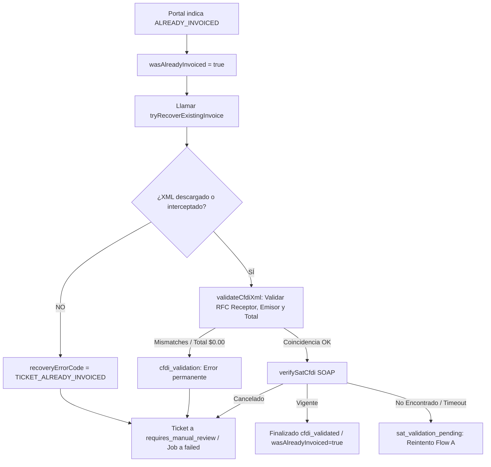

# Ciclo de Vida de los Tickets

Este documento detalla el flujo de estados y transiciones que experimenta un ticket en ZenTicket, desde su digitalización (OCR) hasta la validación y timbrado de su CFDI.

---

## 1. Mapa de Estados del Ticket

1. **`pending_ocr` / `processing`:** El usuario sube la imagen o PDF del ticket. El motor de extracción OCR procesa los datos de compra (monto total, fecha, referencia).
2. **`ocr_failed`:** El OCR no pudo extraer los datos debido a mala calidad de imagen o formato ilegible. Requiere corrección visual o ingreso manual de datos.
3. **`ocr_completed`:** Extracción exitosa. El ticket cuenta con fecha, total y referencia.
4. **`queued_for_runner`:** El ticket tiene un job de facturación encolado pendiente de procesamiento.
5. **`billing_in_progress`:** El runner de Playwright adquiere el job (`lockJob`) e inicia el navegador Chromium para interactuar con el portal del comercio.
6. **`cfdi_validated`:** Éxito definitivo. El XML fue descargado, pasó la validación estructural local (RFC, importes) y fue confirmado como "Vigente" ante el SAT.
7. **`sat_validation_pending`:** La factura fue emitida exitosamente en el portal, pero el webservice del SAT no localizó el comprobante de inmediato. Se ha programado un reintento diferido (Flow A).
8. **`waiting_fiscal_profile`:** El portal requiere datos fiscales adicionales que no estaban presentes o eran inválidos en el perfil del usuario.
9. **`waiting_merchant_sync`:** El ticket es muy reciente y el portal del comercio aún no lo registra en sus bases de datos de facturación.
10. **`missing_required_fields`:** El portal solicita referencias adicionales del ticket (ej: código postal de sucursal) que no estaban en la carga del ticket.
11. **`waiting_user_captcha`:** El portal activó una protección humana interactiva (CAPTCHA) y se requiere la intervención del solver o del usuario para desbloquearlo.
12. **`requires_manual_review`:** Estado de fallo permanente o fin de reintentos. Requiere intervención del administrador de ZenTicket.

---

## 2. Flujo Robusto de "Ticket ya Facturado"

Cuando el portal indica que el ticket ya fue facturado previamente (`ALREADY_INVOICED`), ZenTicket ejecuta las siguientes políticas para evitar facturas ficticias o en cero:

### A. Recuperación Activa y Validaciones
* **No simular éxito:** Si no se localiza la descarga física de un XML real (descarga directa, blobs, o capturado en red), el sistema aborta de inmediato con el código `TICKET_ALREADY_INVOICED` y el ticket pasa a `requires_manual_review`.
* **Prohibido generar XMLs ficticios (dummy):** Se ha eliminado todo fallback de XMLs artificiales. La factura debe ser auténtica.
* **Validación rigurosa de importes:** El XML recuperado debe coincidir con el total esperado del ticket y no debe ser `$0.00` (a menos que el ticket original sea de `$0.00`). Si hay diferencia, se arroja `CFDI_TOTAL_MISMATCH`.
* **Validación de RFC Receptor:** El RFC del nodo Receptor en el XML recuperado debe coincidir estrictamente con el RFC del perfil fiscal del usuario (`CFDI_RFC_RECEPTOR_MISMATCH`).

### B. Exposición Gradual de Errores
* **El Administrador** ve la traza detallada en `runner_logs` mediante el objeto `DiagnosticSnapshot` (que incluye la bandera `wasAlreadyInvoiced: true` y el avance de validaciones).
* **El Usuario Final** ve en su pantalla de tickets un mensaje claro generado por `reviewError` (ej: *"Este ticket ya ha sido facturado con anterioridad..."*), manteniendo la privacidad de la infraestructura del backend.
