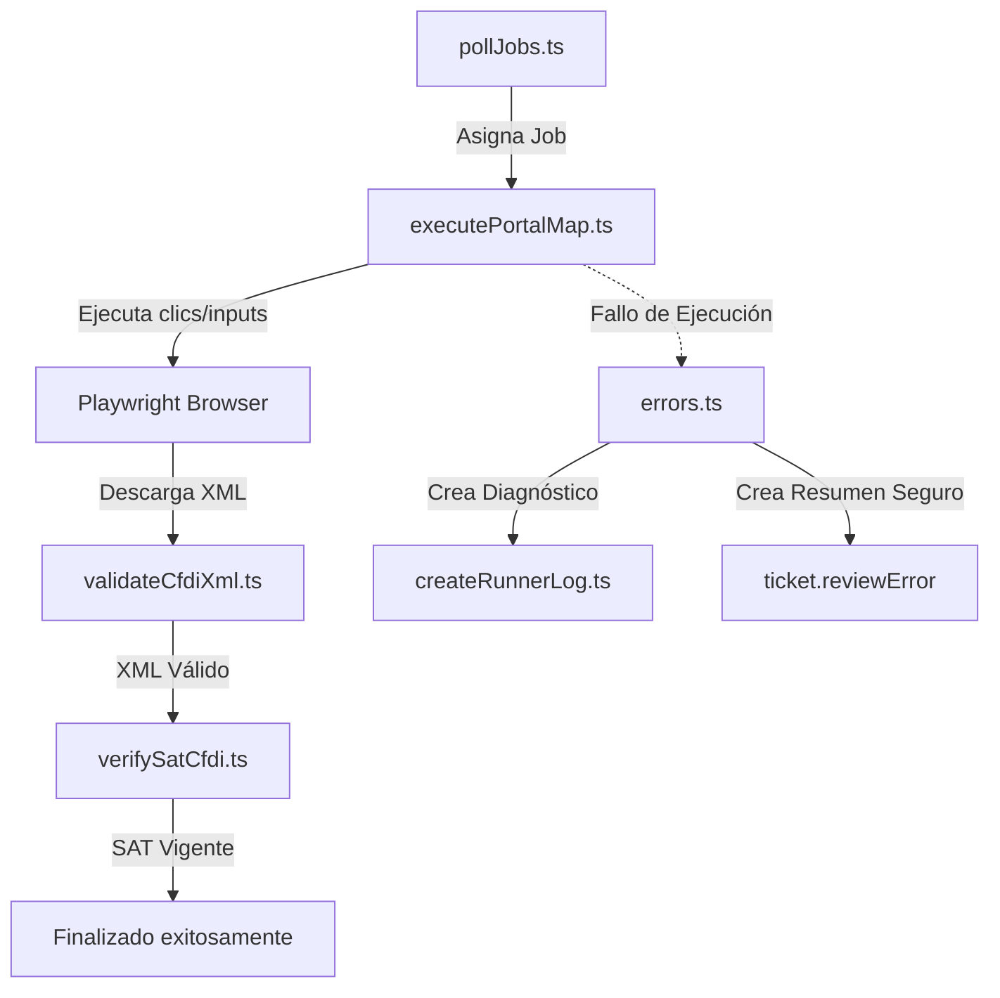

# Arquitectura de Motores en el Runner

Para garantizar que el runner de automatización sea mantenible y escalable, se ha separado en motores especializados ubicados bajo `runner/src/engines/`.

---

## 1. Motores del Runner

* **`automation/` (Motor de Automatización):** Encargado de la ejecución de Playwright y comandos dinámicos (`portalMap`).
* **`cfdi/` (Motor CFDI):** Validador estructural, semántico y de coincidencia de facturas XML locales. Su catálogo interno de errores devueltos se alinea con el catálogo global del sistema.
* **`sat/` (Motor SAT):** Conector con los servidores oficiales del SAT para verificar la vigencia de las facturas (CFDI).
* **`errors/` (Motor de Diagnóstico y Catálogo de Errores):** Catálogo centralizado (`errorCatalog.ts`), taxonomía de ejecución (`runnerStages.ts`), mapeador de mensajes (`friendlyMessages.ts`), validador de reintentos (`classifyAutomationError.ts`) y creador de traza estructurada (`diagnosticSnapshot.ts`).

---

## 2. Flujo de Datos entre Motores

